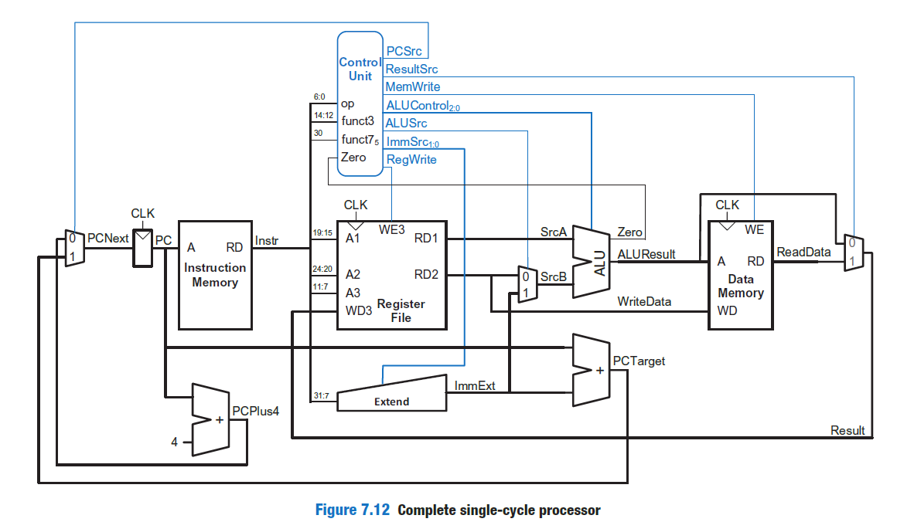
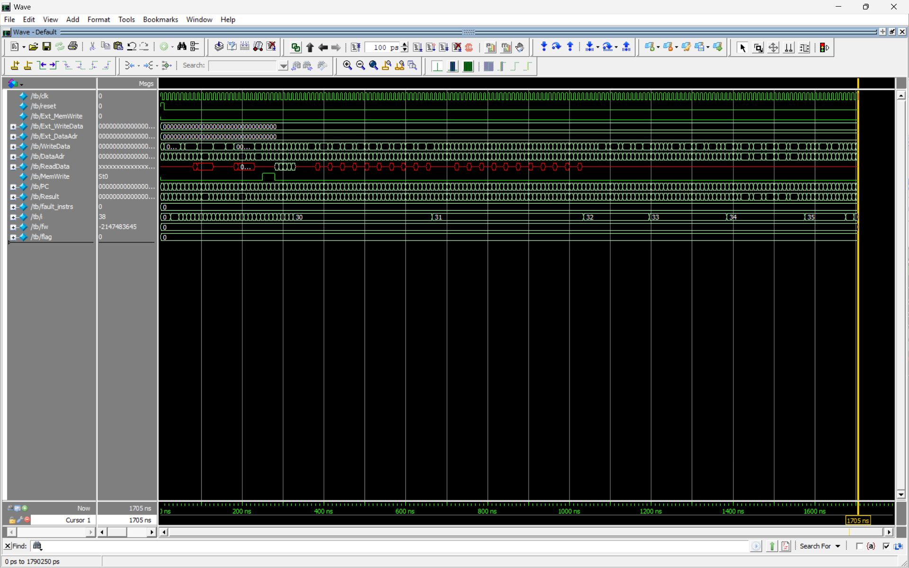
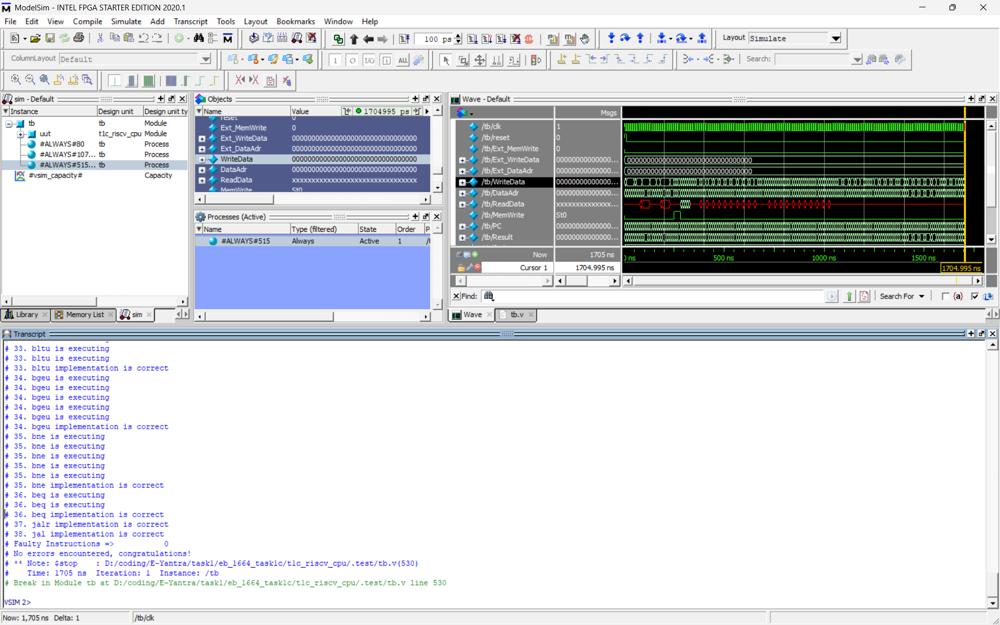
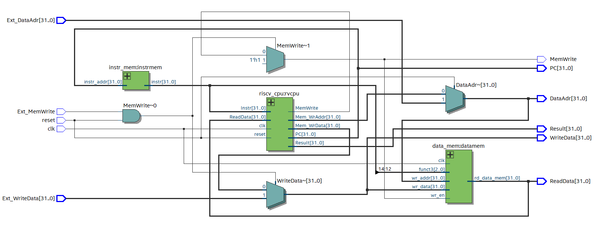
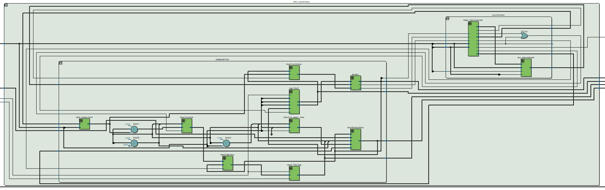
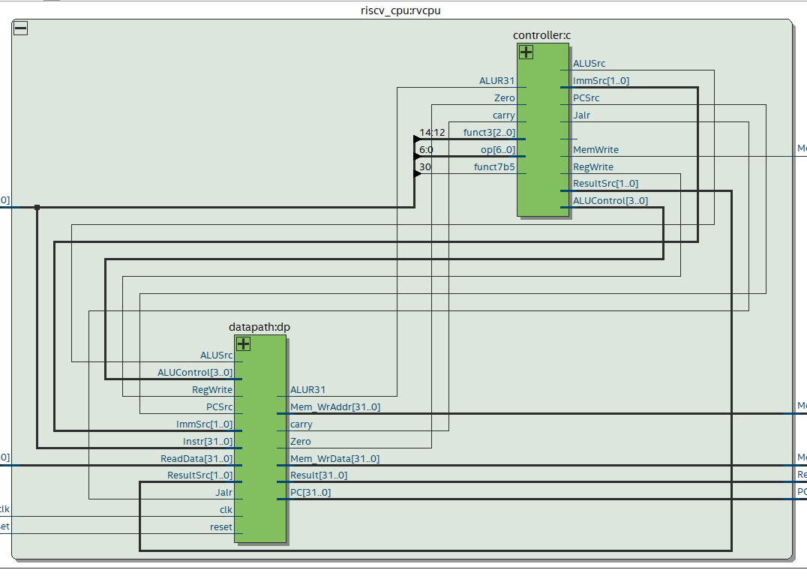
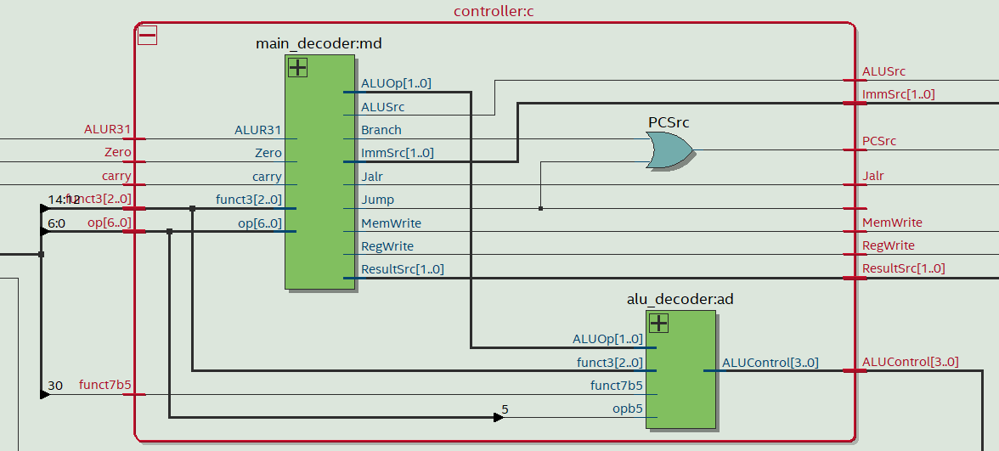
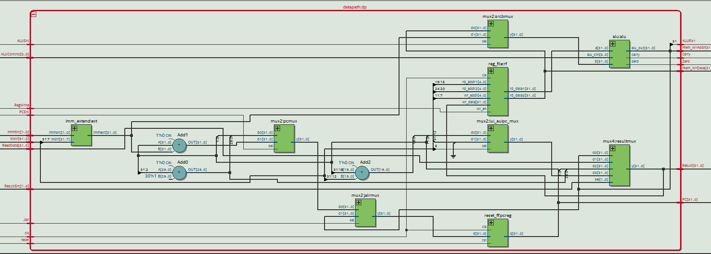

# RISC-V Single Cycle CPU

This repository contains the implementation of a **32-bit RISC-V Single Cycle CPU** that supports all six basic types of instructions: R, I, S, B, U, and J. The CPU design has been thoroughly tested and validated against a comprehensive testbench, ensuring correctness for all implemented instructions.

## Features

### **Supported Instruction Types**

The CPU supports the following instruction types along with their respective instructions:

| **Instruction Type** | **Instructions**                                                                 |
|-----------------------|---------------------------------------------------------------------------------|
| **R-Type**            | `add`, `sub`, `sll`, `slt`, `sltu`, `xor`, `srl`, `sra`, `or`, `and`           |
| **I-Type**            | `addi`, `slti`, `sltiu`, `xori`, `ori`, `andi`, `lb`, `lh`, `lw`, `lbu`, `lhu` |
| **S-Type**            | `sb`, `sh`, `sw`                                                              |
| **B-Type**            | `beq`, `bne`, `blt`, `bge`, `bltu`, `bgeu`                                    |
| **U-Type**            | `lui`, `auipc`                                                                |
| **J-Type**            | `jal`, `jalr`                                                                 |

All the above instructions have been implemented and verified for a **32-bit architecture**.

---

## Module Description

The CPU module includes the following input and output signals:

| **Signal Name**      | **Direction** | **Description**                                                      |
|-----------------------|---------------|----------------------------------------------------------------------|
| **clk**              | Input         | Clock input for the module.                                          |
| **reset**            | Input         | Reset signal for resetting the module.                              |
| **Ext_MemWrite**     | Input         | External signal indicating memory write operation.                   |
| **Ext_WriteData**    | Input         | External data to be written into data memory.                        |
| **Ext_DataAdr**      | Input         | External address for read/write operation in memory.                 |
| **MemWrite**         | Output        | Signal indicating memory write operation.                            |
| **WriteData**        | Output        | Data to be written into data memory.                                 |
| **DataAdr**          | Output        | Address for read/write operation from/to the data memory.            |
| **ReadData**         | Output        | Data read from the data memory.                                      |
| **PC**               | Output        | Value of the program counter for debugging.                          |
| **Result**           | Output        | ALU result for debugging purposes.                                   |

---
## Architecture Overview

The CPU is based on a single-cycle architecture, adhering to the RISC-V ISA (32-bit). The key components include:

- **Program Counter (PC):** Tracks the current instruction.
- **Instruction Memory:** Stores the program instructions.
- **Data Memory:** Handles load/store operations.
- **Register File:** Contains 32 general-purpose registers.
- **ALU (Arithmetic Logic Unit):** Performs arithmetic and logical operations.
- **Control Unit:** Decodes instructions and generates control signals.
- **Immediate Generator:** Extracts and extends immediate values from instructions.

Refer to the architecture diagram for more details:  

## Simulation Results

1. **Testbench Output**  
   The CPU has been tested using a comprehensive testbench covering all six instruction types. The outputs validate the correct execution of instructions.  
   - **Output Signal:**  
       
   - **Output Transcript:**  
       

2. **Netlist Viewer**  
   Snapshots from Quartus Prime Netlist Viewer illustrating the architecture:  
   - **CPU Overview:**  
       
   - **Inside CPU Block:**  
       
     Additional detailed views for clarity:  
     -   
     -   
     -   

## Reference Textbook

This design is based on concepts from the following textbook:  
**Digital Design and Computer Architecture: RISC-V Edition** by Sarah L. Harris and David Harris.
